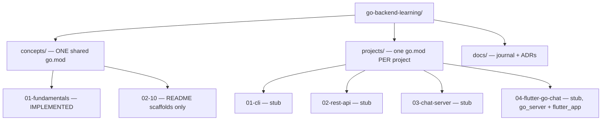

# System architecture

## Repository shape

The `concepts/` vs `projects/` module boundary is a deliberate decision, not an
accident — see [[concepts-vs-projects-module-split]] for the full reasoning and
rejected alternatives. In short: `concepts/` is disposable teaching snippets
sharing one module; `projects/` are independently runnable apps, each isolated
so one project's dependency bump can't touch another's `go.sum`.

**Practical consequence:** there is no root `go.mod`. Always `cd` into
`concepts/` or a specific `projects/*` directory before running `go` commands.

## Current implementation status

| Area | Status | Evidence |
|---|---|---|
| `concepts/01-fundamentals` | Implemented, tested | `point.go` + `point_test.go`, see [[value-vs-pointer-receivers]] |
| `concepts/02-10` (9 folders) | Scaffold only | README + empty `.gitkeep` dirs |
| `projects/01-cli` | Stub | `main.go` is one `TODO` println |
| `projects/02-rest-api` | Stub | `cmd/api/main.go` is one `TODO` println, `internal/task/` empty |
| `projects/03-chat-server` | Stub | see [[websocket-server-projects]] |
| `projects/04-flutter-go-chat` | Stub, both Go and Flutter sides | see [[websocket-server-projects]] |

## CI

Two GitHub Actions workflows exist and run on every push/PR:
`go-lint.yml` (`gofmt -l .` check) and `go-test.yml` (`go vet` + `go test -race`
per module). Both are **configured, not yet meaningfully exercised** — there's
only one test file in the whole repo. `go-test.yml` also has a known gap: see
[[ci-workflow-shallow-glob-gap]].

No Docker, no database, no deployment config exist yet — nothing in the repo
currently claims otherwise.

## Learning vs production framing

Where a choice here (module-per-project, flat `internal/task` handler/service
split instead of Clean Architecture layers, stdlib-only `net/http` instead of a
framework) was made to keep a *learning* exercise legible, treat it as
learning-appropriate, not as this repo's opinion on how a real production
service should be built. Each such choice is called out explicitly on its
decision page rather than left implicit.
