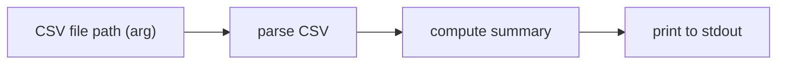

# Key flows

There is no running data/request flow anywhere in this repo yet — every
`main.go` and `main.dart` is a placeholder that prints or renders a `TODO`
string. This page will start being meaningful once a project moves past stub
stage; until then, recording a flow here would be fiction.

## First flow expected

`projects/01-cli` (CLI transaction summarizer) is the simplest project and the
most likely candidate for the repo's first real flow:

This is inferred from the stated intent in `projects/01-cli/README.md` and
`main.go`'s TODO comment, not from any implemented code. Update this page with
the *actual* flow once `01-cli` has real logic — don't leave the inferred
diagram standing in as if it were built.
