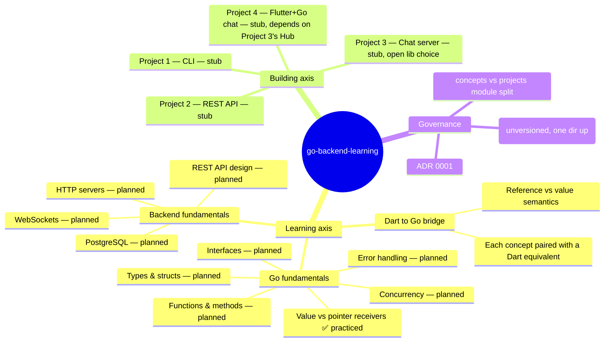

# Feature mindmap

The two axes — **learning** (concept-by-concept, in `concepts/`) and
**building** (project-by-project, in `projects/`) — are meant to reinforce each
other per the external curriculum's design: a concept is learned in isolation,
then later applied inside a project. As of now only the learning axis has any
real content (one concept), and the building axis is entirely unstarted.
